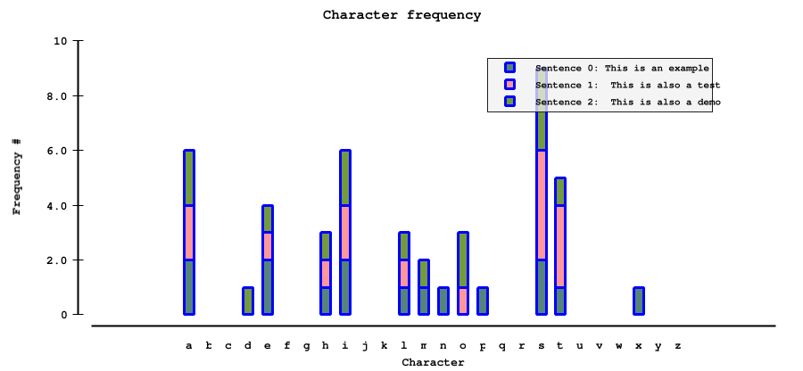
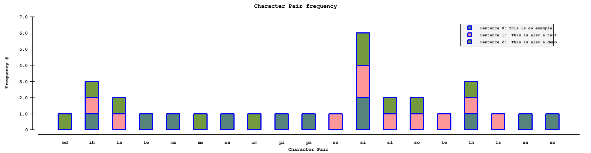

# sentencestats: character-pairs and characters - A plotter for character use in a sentence

This library has no real use... Just hacked it together for fun. Hopefully someone else can enjoy it somewhere.

It takes input creates a histogram plot based on character use in the sentence as follows:

## characters
A histogram for each character used:



### Usage
```
$ echo "This is an example. This is also a test. This is also a demo." | go run ./cmd/characters/ -o characters-example.png
# or
$ echo "This is an example. This is also a test. This is also a demo." | go run github.com/arran4/sentencestats/cmd/characters/ -o characters-example.png
# or
$ echo "This is an example. This is also a test. This is also a demo." | go run characters-plot -o characters-example.png
```

## character-pairs
A histogram for each character pair used (order ignored)



### Usage
```
$ echo "This is an example. This is also a test. This is also a demo." | go run ./cmd/character-pairs/ -o character-pairs-example.png
# or
$ echo "This is an example. This is also a test. This is also a demo." | go run github.com/arran4/sentencestats/cmd/character-pairs/ -o character-pairs-example.png
# or
$ echo "This is an example. This is also a test. This is also a demo." | character-pairs-plot -o character-pairs-example.png
```
