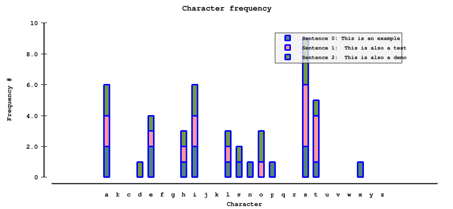
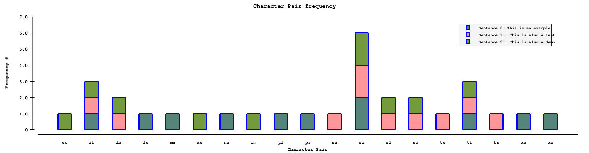

# Sentence Stats

Sentence Stats is a Go tool for visualizing character and character pair frequencies in sentences. It generates histogram plots to help analyze the composition of text.

## Features

- **Character Frequency**: Visualizes the frequency of each character in the input text.
- **Character Pair Frequency**: Visualizes the frequency of character pairs (bigrams), ignoring order (e.g., "ab" and "ba" are counted together).
- **Sentence-based Analysis**: Processes input sentence by sentence (split by '.').

## Installation

Ensure you have Go installed (version 1.22+).

```bash
go install github.com/arran4/sentencestats/cmd/characters@latest
go install github.com/arran4/sentencestats/cmd/character-pairs@latest
```

## Usage

The tools read from standard input and output a PNG file.

### Character Frequency

```bash
echo "This is an example. This is also a test. This is also a demo." | characters -o characters-example.png
```

Output:



### Character Pair Frequency

```bash
echo "This is an example. This is also a test. This is also a demo." | character-pairs -o character-pairs-example.png
```

Output:



## Development

To run the tools from source:

```bash
go run ./cmd/characters/ -o out.png < input.txt
go run ./cmd/character-pairs/ -o out.png < input.txt
```

To run tests:

```bash
go test ./...
```
